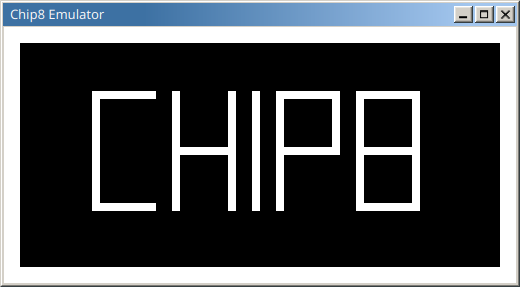
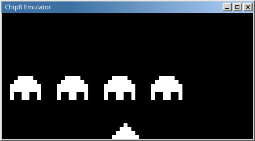

Chip8 Emulator
==============

Learning project to implement the 70's Chip8 architecture. Sources:

- https://en.wikipedia.org/wiki/CHIP-8#Virtual_machine_description
- http://mattmik.com/files/chip8/mastering/chip8.html
- http://www.multigesture.net/articles/how-to-write-an-emulator-chip-8-interpreter/
- http://devernay.free.fr/hacks/chip8/C8TECH10.HTM

Run: `go run main <ROM_NAME>`

You can find [roms here](https://github.com/loktar00/chip8/tree/master/roms).